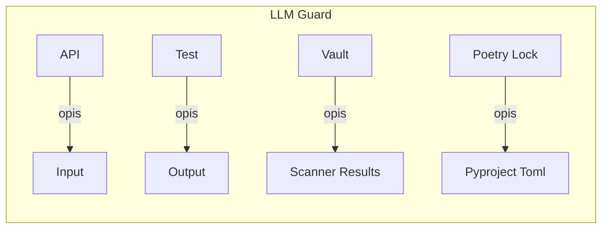
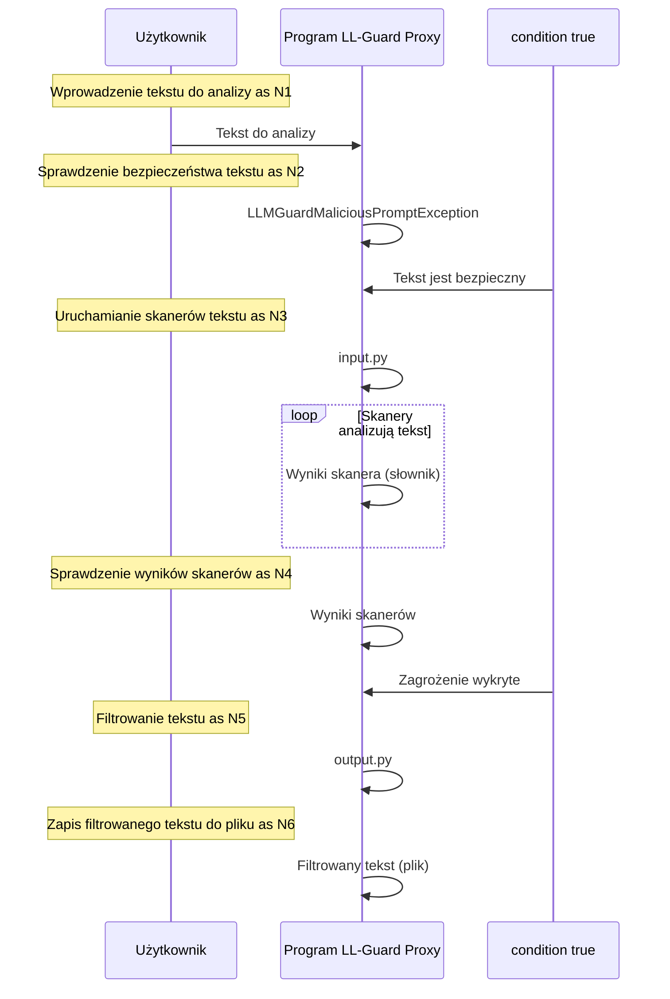

# Dokumentacja Techniczna Projektu


---

## 1. OPIS PROJEKTU I DIAGRAM ARCHITEKTURY

### Opis
LLM Guard jest systemem, który służy do analizy i filtrowania niebezpiecznych promptów w kontekście generowania tekstu. Projekt ten rozwiązuje problem toksyczności i anonimizacji treści w sieciach społecznościowych.



W powyższym diagramie architektury przedstawiono następujące komponenty:

* `API`: moduł, który obsługuje połączenie z serwerem LLM Guard.
* `Input`: moduł, który służy do testowania i weryfikacji różnych skanerów tekstu.
* `Test`: moduł, który uruchamia testy skanerów wyjściowych.
* `Output`: moduł, który zawiera kod, który uruchamia różne skanery wyjściowe.
* `Vault`: obiekt, który służy do przechowywania i zarządzania danymi.
* `Scanner Results`: plik, który zawiera wyniki skanowania.
* `Poetry Lock` i `Pyproject Toml`: pliki konfiguracyjne, które definiują strukturę i zależności projektu.

---

```
LLMGuard
└── llmguardproxy
    ├── src
    │   └── llmguardproxy
    │       └── __init__.py  # Inicjalizacja modułu
    ├── tests
    │   └── __init__.py  # Definiowanie pakietu testów
    ├── api.py  # Obsługa połączenia z serwerem LLM Guard
    ├── input.py  # Testowanie i weryfikacja skanerów tekstu
    ├── output.py  # Uruchamianie skanerów wyjściowych i ocenianie wyników
    ├── poetry.lock  # Konfiguracja projektu Pythona z biblioteką Poetry
    ├── pyproject.toml  # Definiowanie projektu, jego zależności i konfiguracji budowy
    ├── README.md  # Dokumentacja projektu
    └── scanner_results.txt  # Wyniki skanowania tekstu
```

W powyższym drzewie katalogów przedstawiono strukturę projektu LL-Guard Proxy. Każdy plik/folder ma swoją techniczną rolę, która została opisana w sekcjach: Moduł: llmguardproxy\api.py, Moduł: llmguardproxy\input.py, Moduł: llmguardproxy\output.py, Moduł: llmguardproxy\pyproject.toml i Moduł: llmguardproxy\src\llmguardproxy\__init__.py.

---

### Moduł: llmguardproxy/api.py
Plik `api.py` jest częścią systemu LLM Guard, który służy do analizy i filtrowania niebezpiecznych promptów w kontekście generowania tekstu. Ten plik obsługuje połączenie z serwerem LLM Guard, aby sprawdzić, czy dany prompt jest bezpieczny.

* `LLMGuardMaliciousPromptException`: wyjątek rzucany, gdy LLM Guard detekuje niebezpieczny prompt.
	+ Parametry: `scores` (słownik z wynikami skanowania)
* `LLMGuardRequestException`: wyjątek rzucany, gdy następuje błąd w połączeniu z serwerem LLM Guard.
* `request_llm_guard_prompt(prompt: str)`: funkcja, która wysyła żądanie do serwera LLM Guard, aby sprawdzić, czy dany prompt jest bezpieczny.
	+ Parametr: `prompt` (tekstowy prompt do analizy)
	+ Zwraca: `sanitized_prompt` (bezpieczny prompt po filtrowaniu)

### Moduł: llmguardproxy/input.py
Plik `input.py` jest częścią projektu LLmGuard, służy do testowania i weryfikacji różnych skanerów tekstu. Skanery te są odpowiedzialne za analizę treści i wykrywanie różnych typów treści, takich jak toksyczność, anonimizacja, bannery itp.

* `run_scanner_tests`: Funkcja testująca skanery tekstu, która uruchamia każdy skaner na przetestowanym tekście.
	+ Parametry: brak
	+ Rola: Uruchamianie testów skanera
* `Vault()`: Inicjalizacja Vault - obiekt służący do przechowywania i zarządzania tajnymi informacjami.
	+ Parametry: brak
	+ Rola: Inicjalizacja Vault
* `Toxicity(threshold=0.5, match_type=MatchType.SENTENCE)`: Skaner toksyczności tekstu.
	+ Parametry:
		- `threshold`: Procentowy próg toksyczności
		- `match_type`: Typ analizy (w tym przypadku - na poziomie zdania)
	+ Rola: Analiza toksyczności tekstu

### Moduł: llmguardproxy/output.py
Plik `output.py` jest częścią projektu LLmGuard, który służy do testowania i oceniania wyjścia modeli językowych w kontekście bezpieczeństwa danych. Ten plik zawiera kod, który uruchamia różne skanery wyjściowe, aby sprawdzić, czy dane są zgodne z określonymi kryteriami.

* `run_output_scanner_tests`: Główna funkcja, która uruchamia testy skanerów wyjściowych.
	+ Parametry: brak
	+ Rola: Uruchamianie testów skanerów wyjściowych i zapisanie wyników do pliku.
* `scanners`: lista testów, które zawierają:
	+ Nazwa (string): nazwa skanera
	+ Instancja skanera (obiekt): obiekt skanera, np. `Toxicity(threshold=0.5)`
	+ Odpowiedź modelu do przetestowania (string): przykładowa odpowiedź modelu, np. `"I am a helpful assistant but you are being very rude!"`
* `scan`: metoda skanera, która sprawdza wyjście modelu i zwraca:
	+ Sanitized output (string): wyjście skanera
	+ Is valid (bool): czy wyjście jest poprawne
	+ Risk score (float): wskaźnik ryzyka

---

## 4. UŻYTE BIBLIOTEKI I TECHNOLOGIE

| Biblioteka | Rola w projekcie |
| --- | --- |
| llm-guard | Obsługa analizy i filtrowania niebezpiecznych promptów, integracja z serwerem LLM Guard |
| requests | Wymagana dla obsługi połączeń z serwerem LLM Guard |

W projekcie LL-Guard Proxy wykorzystywane są dwie biblioteki: `llm-guard` i `requests`. Biblioteka `llm-guard` służy do analizy i filtrowania niebezpiecznych promptów, co jest ważnym aspektem w kontekście generowania tekstu. Wymagana jest również biblioteka `requests`, która umożliwia obsługę połączeń z serwerem LLM Guard.

---

## 5. KONTENERYZACJA (DOCKER)

Plik `Dockerfile` w katalogu `llmguardproxy` służy do budowy obrazu kontenera Dockera. Kontener ten odpala aplikację LL-Guard Proxy, która obsługuje połączenie z serwerem LLM Guard i sprawdza, czy dany prompt jest bezpieczny.

Porty:

* `5000`: port, na którym aplikacja LL-Guard Proxy będzie dostępna

Wolumeny:

* `/app`: wolumen, który przechowuje kod źródłowy aplikacji LL-Guard Proxy
* `/data`: wolumen, który służy do przechowywania danych aplikacji LL-Guard Proxy

Zmienne środowiskowe:

* `LLM_GUARD_URL`: zmienna środowiskowa, która określa adres URL serwera LLM Guard
* `PROMPT_THRESHOLD`: zmienna środowiskowa, która określa próg toksyczności dla promptów

---

## 6. STRUKTURA BAZY DANYCH

> Brak wykrytych tabel bazy danych.


---

## 7. PRZEPŁYW DZIAŁANIA I DIAGRAM MERMAID

### Opis sekwencji działania

1. Użytkownik wprowadza tekst do analizy.
2. Program sprawdza, czy tekst jest bezpieczny, korzystając z modułu `LLMGuardMaliciousPromptException`.
3. Jeśli tekst jest bezpieczny, program uruchamia skanery tekstu (np. toksyczność, anonimizacja, bannery itp.) za pomocą modułu `input.py`.
4. Skanery analizują tekst i zwracają wyniki w postaci słownika.
5. Program sprawdza wyniki skanerów i wykrywa potencjalne zagrożenia.
6. Jeśli program wykryje zagrożenie, uruchamia procedurę filtrowania tekstu za pomocą modułu `output.py`.
7. Filtrowany tekst jest zapisywany do pliku.

### Diagram Mermaid



Subgraph "Skanery"
    participant S1 as "Toxicity"
    participant S2 as "Anonymize"
    participant S3 as "BanSubstrings"

    note "Analiza toksyczności" as N7
    P->>S1: Tekst do analizy

    note "Analiza anonimizacji" as N8
    P->>S2: Tekst do analizy

    note "Zakaz słów" as N9
    P->>S3: Tekst do analizy
end