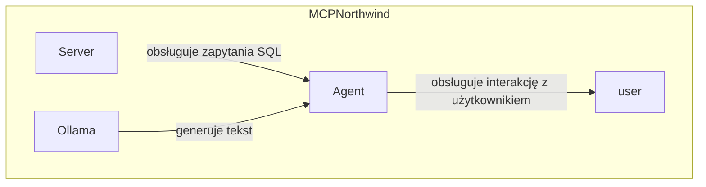
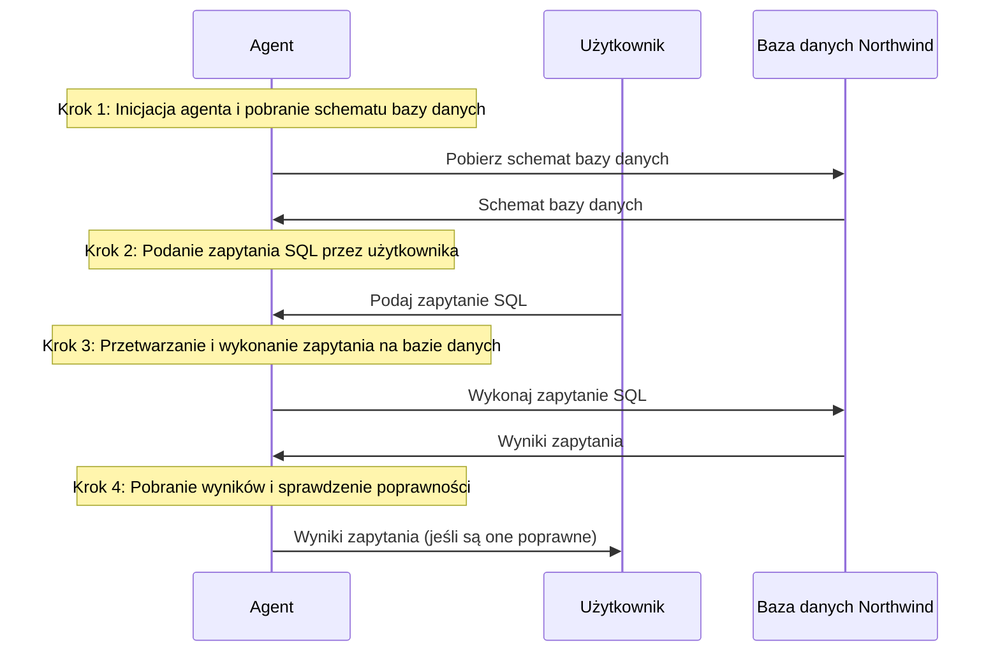

# Dokumentacja Techniczna Projektu


---

## 1. OPIS PROJEKTU I DIAGRAM ARCHITEKTURY

### Opis projektu
Projekt "MCPNorthwind" to aplikacja, która obsługuje interakcję z użytkownikiem poprzez generowanie zapytań SQL na podstawie schematu bazy danych Northwind. Aplikacja korzysta z modelu Ollama do generowania tekstu i obsługuje dwie podstawowe funkcje: pobieranie schematu bazy danych Northwind i wykonanie zapytań SQL.



W diagramie przedstawiono trzy komponenty: Agent, Server i Ollama. Agent obsługuje interakcję z użytkownikiem, Server obsługuje zapytania SQL, a Ollama generuje tekst.

---

```
MCPNorthwind
├── agent.py
│   **SQL agent that uses Ollama model to generate SQL queries based on Northwind database schema**
├── docker-compose.yml
│   **Configures and runs containers for the project using Docker Compose**
├── northwind.db
│   **SQLite database file containing the Northwind database schema**
├── poetry.lock
│   **Lockfile that specifies the exact versions of dependencies required by the project**
├── pyproject.toml
│   **Configuration file for the project, specifying its name, version, and dependencies**
├── README.md
│   **README file containing information about the project and its usage**
└── server.py
    **Server script that provides an interface to execute SQL queries on the Northwind database**
```
Note: The above structure is based on the context provided in the "KONTEKST PROJEKTU" section.

---

## 3. OPIS DZIAŁANIA MODUŁÓW I ICH FUNKCJI

### agent.py
Agent SQL to a module that uses the Ollama model to generate SQL queries based on the Northwind database schema. It interacts with the user, retrieves the schema, and creates an SQL query according to what the user requested.

| Funkcja | Parametry wejściowe | Rola |
| --- | --- | --- |
| `main()` | Brak | Uruchamia agenta i pobiera schemat bazy danych. |
| `stdio_client()` | `server_params` (konfiguracja uruchamiania serwera) | Tworzy połączenie z serwerem MCP. |
| `ChatOllama()` | `model` (nazwa modelu), `temperature` (temperatura generacji) | Inicjuje model Ollama do generowania tekstu. |
| `list_tools()` | Brak | Pobiera listę narzędzi dostępnych w serwerze MCP. |
| `initialize()` | Brak | Inicjuje sesję klienta serwera MCP. |

### docker-compose.yml
This file is used to configure and run containers within the Docker system. It defines a service named "ollama" with an image of "ollama/ollama:latest", which is mapped to port 11434.

| Funkcja | Parametry wejściowe | Rola |
| --- | --- | --- |
| `service ollama` | image: ollama/ollama:latest, container_name: ollama_mcp, ports: - "11434:11434", volumes: - ollama_data:/root/.ollama, restart: unless-stopped | Definiuje usługę "ollama" z konfiguracją kontenera |
| `volume ollama_data` |  | Definiuje wolumen "ollama_data" do przechowywania danych aplikacji |

### pyproject.toml
This file is the configuration file for the Python project, used to define information about the project, its version, authors, requirements, and dependencies. It is a central file for the project that allows managing dependencies and building the project.

| Funkcja | Parametry wejściowe | Rola |
| --- | --- | --- |
| `[project]` |  | Definiuje informacje o projekcie. |
| `[build-system]` |  | Definiuje backend budowania projektu. |

### server.py
This file is the Micro-Controller Protocol (MCP) server, named "SQL-Agent-Server". It handles two main functions: retrieving the Northwind database schema and executing SQL queries.

| Funkcja | Parametry wejściowe | Rola |
| --- | --- | --- |
| `get_db_schema()` | Brak | Zwraca listę tabel, ich kolumn oraz opis relacji w bazie Northwind. |
| `run_sql_query(query: str)` | `query` (zapytanie SQL do wykonania) | Wykonuje bezpieczne zapytanie SQL SELECT na bazie Northwind i zwraca wyniki jako tekst.

---

## 4. UŻYTE BIBLIOTEKI I TECHNOLOGIE

* Poetry (Biblioteka budowania projektu) - służy do zarządzania zależnościami i budowaniem projektu.
* Docker (Technologia kontenerowa) - umożliwia uruchamianie aplikacji w kontenerach, co zapewnia izolację środowiska wykonawczego.

---

## 5. KONTENERYZACJA (DOCKER)

Opis: Plik `docker-compose.yml` służy do konfigurowania i uruchamiania kontenerów w ramach systemu Docker. W tym przypadku definiuje on usługę o nazwie "ollama" z obrazem "ollama/ollama:latest", która jest mapowana na port 11434.

| Funkcja | Parametry wejściowe | Rola |
| --- | --- | --- |
| service ollama | image: ollama/ollama:latest, container_name: ollama_mcp, ports: - "11434:11434", volumes: - ollama_data:/root/.ollama, restart: unless-stopped | Definiuje usługę "ollama" z konfiguracją kontenera |

Wolumen `ollama_data` jest mapowany na katalog `/root/.ollama` w kontenerze.

---

### Categories
Kolumna | Typ | Opis/Rola
---------|------|-----------
CategoryID | INTEGER | Primary key, auto-incrementing ID for each category.
CategoryName | TEXT | Name of the category.
Description | TEXT | Brief description of the category.
Picture | BLOB | Image associated with the category.

### CustomerCustomerDemo
Kolumna | Typ | Opis/Rola
---------|------|-----------
CustomerID | TEXT | Foreign key referencing the Customers table.
CustomerTypeID | TEXT | Foreign key referencing the CustomerDemographics table.
PRIMARY KEY (CustomerID, CustomerTypeID)

### CustomerDemographics
Kolumna | Typ | Opis/Rola
---------|------|-----------
CustomerTypeID | TEXT | Primary key, unique ID for each customer demographic type.
CustomerDesc | TEXT | Description of the customer demographic type.

### Customers
Kolumna | Typ | Opis/Rola
---------|------|-----------
CustomerID | TEXT | Primary key, unique ID for each customer.
CompanyName | TEXT | Name of the company.
ContactName | TEXT | Name of the contact person.
ContactTitle | TEXT | Title of the contact person (e.g. "Sales Representative").
Address | TEXT | Mailing address of the customer.
City | TEXT | City where the customer is located.
Region | TEXT | Region or state where the customer is located.
PostalCode | TEXT | Postal code for the customer's location.
Country | TEXT | Country where the customer is located.
Phone | TEXT | Phone number of the customer.
Fax | TEXT | Fax number of the customer.

### Employees
Kolumna | Typ | Opis/Rola
---------|------|-----------
EmployeeID | INTEGER | Primary key, auto-incrementing ID for each employee.
LastName | TEXT | Last name of the employee.
FirstName | TEXT | First name of the employee.
Title | TEXT | Job title or position of the employee.
TitleOfCourtesy | TEXT | Title of courtesy (e.g. "Mr.", "Ms.", etc.).
BirthDate | DATE | Date of birth for the employee.
HireDate | DATE | Date when the employee was hired.
Address | TEXT | Mailing address of the employee.
City | TEXT | City where the employee is located.
Region | TEXT | Region or state where the employee is located.
PostalCode | TEXT | Postal code for the employee's location.
Country | TEXT | Country where the employee is located.
HomePhone | TEXT | Home phone number of the employee.
Extension | TEXT | Phone extension of the employee.
Photo | BLOB | Employee photo.
Notes | TEXT | Notes or comments about the employee.

### EmployeeTerritories
Kolumna | Typ | Opis/Rola
---------|------|-----------
EmployeeID | INTEGER | Foreign key referencing the Employees table.
TerritoryID | TEXT | Foreign key referencing the Territories table.
PRIMARY KEY (EmployeeID, TerritoryID)

### Order Details
Kolumna | Typ | Opis/Rola
---------|------|-----------
OrderID | INTEGER | Foreign key referencing the Orders table.
ProductID | INTEGER | Foreign key referencing the Products table.
UnitPrice | NUMERIC | Price of each unit of the product.
Quantity | INTEGER | Quantity of products ordered.
Discount | REAL | Discount applied to the order.

### Orders
Kolumna | Typ | Opis/Rola
---------|------|-----------
OrderID | INTEGER | Primary key, auto-incrementing ID for each order.
CustomerID | TEXT | Foreign key referencing the Customers table.
EmployeeID | INTEGER | Foreign key referencing the Employees table.
OrderDate | DATETIME | Date when the order was placed.
RequiredDate | DATETIME | Date by which the order should be shipped.
ShippedDate | DATETIME | Date when the order was shipped.
ShipVia | INTEGER | Shipping method used for the order.
Freight | NUMERIC | Total freight cost for the order.
ShipName | TEXT | Name of the shipper.
ShipAddress | TEXT | Mailing address of the shipper.
ShipCity | TEXT | City where the shipper is located.
ShipRegion | TEXT | Region or state where the shipper is located.
ShipPostalCode | TEXT | Postal code for the shipper's location.
ShipCountry | TEXT | Country where the shipper is located.

### Products
Kolumna | Typ | Opis/Rola
---------|------|-----------
ProductID | INTEGER | Primary key, auto-incrementing ID for each product.
ProductName | TEXT | Name of the product.
SupplierID | INTEGER | Foreign key referencing the Suppliers table.
CategoryID | INTEGER | Foreign key referencing the Categories table.
QuantityPerUnit | TEXT | Quantity per unit of the product.
UnitPrice | NUMERIC | Price of each unit of the product.
UnitsInStock | INTEGER | Number of units in stock.
UnitsOnOrder | INTEGER | Number of units on order.
ReorderLevel | INTEGER | Reorder level for the product.
Discontinued | TEXT | Flag indicating whether the product is discontinued.

### Regions
Kolumna | Typ | Opis/Rola
---------|------|-----------
RegionID | INTEGER | Primary key, unique ID for each region.
RegionDescription | TEXT | Description of the region.

### Shippers
Kolumna | Typ | Opis/Rola
---------|------|-----------
ShipperID | INTEGER | Primary key, auto-incrementing ID for each shipper.
CompanyName | TEXT | Name of the company.
Phone | TEXT | Phone number of the shipper.

### Suppliers
Kolumna | Typ | Opis/Rola
---------|------|-----------
SupplierID | INTEGER | Primary key, auto-incrementing ID for each supplier.
CompanyName | TEXT | Name of the company.
ContactName | TEXT | Name of the contact person.
ContactTitle | TEXT | Title of the contact person (e.g. "Sales Representative").
Address | TEXT | Mailing address of the supplier.
City | TEXT | City where the supplier is located.
Region | TEXT | Region or state where the supplier is located.
PostalCode | TEXT | Postal code for the supplier's location.
Country | TEXT | Country where the supplier is located.
Phone | TEXT | Phone number of the supplier.
Fax | TEXT | Fax number of the supplier.
HomePage | TEXT | Home page URL of the supplier.

### Territories
Kolumna | Typ | Opis/Rola
---------|------|-----------
TerritoryID | TEXT | Primary key, unique ID for each territory.
TerritoryDescription | TEXT | Description of the territory.
RegionID | INTEGER | Foreign key referencing the Regions table.

Relacje między tabelami:

* CustomerCustomerDemo: Klient-klucz obce z Customers i CustomerDemographics
* EmployeeTerritories: Pracownik-klucz obce z Employees i Territories
* Order Details: Zamówienie-klucz obce z Orders i Products
* Products: Produkt-klucz obce z Suppliers, Categories, and Regions

---

## 7. PRZEPŁYW DZIAŁANIA I DIAGRAM MERMAID

### Opis sekwencji działania programu:

1. Agent inicjuje się i pobiera schemat bazy danych Northwind.
2. Użytkownik podaje zapytanie SQL, które agent przetwarza i wykonuje na bazie danych.
3. Agent pobiera wyniki zapytania i jeśli są one poprawne, towarzyszy im opis relacji między tabelami.

### Diagram Mermaid:



Subgraph "Baza danych" {
    participant Database as "Baza danych Northwind"
}

Note: This diagram shows the sequence of events in the program, from the agent's initialization to the execution of the SQL query and the retrieval of results. The subgraph represents the database interactions.