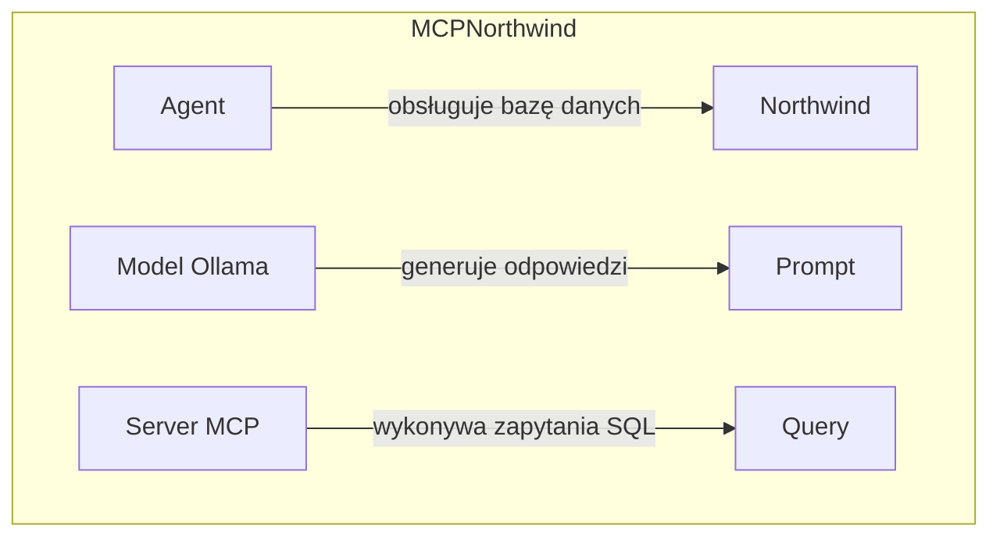

# 📘 Dokumentacja Techniczna Projektu


---

## 1. OPIS PROJEKTU I DIAGRAM ARCHITEKTURY

### Opis:
Projekt "MCPNorthwind" to aplikacja, która obsługuje bazę danych Northwind. Aplikacja korzysta z modelu Ollama do generowania odpowiedzi na pytania i wykonywania zapytań SQL SELECT. Rozwiązuje problem automatyzacji procesów biznesowych w firmie Northwind.



W powyższym diagramie architektury przedstawiono następujące komponenty:

* Agent: obsługuje bazę danych Northwind i wykorzystuje model Ollama do generowania odpowiedzi na pytania.
* Model Ollama: generuje odpowiedzi na podstawie wprowadzonego tekstu.
* Server MCP: wykonywa zapytania SQL SELECT na bazie danych Northwind.

---

```
MCPNorthwind
├── agent.py
│   Techniczna rola: Agencja SQL, która korzysta z modelu Ollama i serwera MCP do generowania zapytań SQL na podstawie schematu bazy danych.
├── docker-compose.yml
│   Techniczna rola: Konfiguracja kontenera w ramach systemu Docker.
├── northwind.db
│   Techniczna rola: Baza danych Northwind, która jest używana przez agenta SQL do generowania zapytań SQL.
├── poetry.lock
│   Techniczna rola: Plik konfiguracyjny, który definiuje wersję i zależności projektu Python.
├── pyproject.toml
│   Techniczna rola: Plik konfiguracyjny, który definiuje informacje o projekcie, jego wersji, autorach, wymaganiach i zależnościach.
├── README.md
│   Techniczna rola: Dokumentacja projektu, która zawiera informacje o jego strukturze, funkcjonalności i użyciu.
├── server.py
│   Techniczna rola: Serwer Micro-Controller Protocol (MCP), który obsługuje bazę danych Northwind i udostępnia informacje o relacjach między tabelami.

```
Note: The above structure is based on the provided context and may not reflect the actual file structure of your project.

---

## 3. OPIS DZIAŁANIA MODUŁÓW I ICH FUNKCJI

### agent.py
Agent SQL to a module that uses the Ollama model and the MCP server to generate SQL queries based on the database schema. It provides functions for connecting to the server, generating queries, and invoking the Ollama model.

* `main()`: Initializes the Ollama model, connects to the server, and generates a SQL query based on the database schema.
	+ Parameters: None
	+ Purpose: Run the agent and generate a SQL query
* `stdio_client()`: Connects to the MCP server using the standard input/output client.
	+ Parameters: `server_params` - configuration for running the server
	+ Purpose: Establish a connection with the server
* `ChatOllama()`: Initializes the Ollama model and sets its temperature.
	+ Parameters: `model` - name of the Ollama model (e.g. "llama3.1"), `temperature` - temperature of the generated text
	+ Purpose: Initialize the Ollama model
* `list_tools()`: Lists the available tools in the server.
	+ Parameters: None
	+ Purpose: Get a list of available tools
* `get_db_schema()`: Retrieves the database schema from the server.
	+ Parameters: None
	+ Purpose: Get the database schema
* `invoke()`: Invokes the Ollama model and generates an answer based on the input text.
	+ Parameters: `[HumanMessage(content=prompt_for_sql)]` - text to be processed by the Ollama model
	+ Purpose: Generate an answer using the Ollama model

### docker-compose.yml
This file defines a service named "ollama" that uses the `ollama/ollama:latest` image. It maps port 11434 on the host to port 11434 in the container and creates a volume for storing data.

* Services:
	+ ollama: Defines a service that uses the `ollama/ollama:latest` image.
		- Ports: Maps port 11434 on the host to port 11434 in the container.
		- Volumes: Creates a volume for storing data.
		- Restart: Specifies that the container should be restarted if it exits.

### pyproject.toml
This file is the configuration file for the project, which defines information about the project, its version, authors, dependencies, and build system. It provides functions for building and installing the project.

* name: The name of the project (mcpnorthwind).
* version: The version of the project (0.1.0).
* description: A brief description of the project.
* authors: A list of authors with their names and email addresses.
* requires-python: The minimum required version of Python for running the project.
* dependencies:
	+ mcp (>=1.28.0,<2.0.0): A dependency on the MCP library.
	+ ollama (>=3.1.0,<4.0.0): A dependency on the Ollama library.

### Employees
This table contains information about employees, including their ID, name, title, and contact information.

* EmployeeID: The unique identifier for each employee.
* LastName: The last name of the employee.
* FirstName: The first name of the employee.
* Title: The job title of the employee.
* BirthDate: The date of birth for the employee.
* HireDate: The date when the employee was hired.

### Order Details
This table contains information about orders, including the order ID, product ID, and quantity ordered.

* OrderID: The unique identifier for each order.
* ProductID: The unique identifier for each product.
* UnitPrice: The price of each unit of the product.
* Quantity: The number of units ordered.
* Discount: The discount applied to the order.

---

## 4. UŻYTE BIBLIOTEKI I TECHNOLOGIE

| Biblioteka | Rola w projekcie |
| --- | --- |
| poetry-core | Budowanie projektu i zarządzanie zależnościami |
| mcp (Multi-Cloud Platform) | Obsługa serwera MCP, generacja zapytań SQL i komunikacja z bazą danych Northwind |
| langchain-ollama | Generacja odpowiedzi na podstawie wprowadzonego tekstu za pomocą modelu Ollama |
| langchain-community | Udostępnianie narzędzi i funkcji do pracy z modelem Ollama |
| fastmcp | Akceleracja obsługi serwera MCP, poprawa wydajności i efektywności |

Wszystkie te biblioteki są niezbędne do uruchomienia projektu i jego normalnego funkcjonowania.

---

## 5. KONTENERYZACJA (DOCKER)

### Moduł: docker-compose.yml

Ten plik służy do konfiguracji kontenera w ramach systemu Docker. W szczególności, definiuje on serwis o nazwie "ollama" i tworzy wolumin danych dla niego.

* `services`:
	+ `ollama`: Definicja serwisu, który korzysta z obrazu kontenera `ollama/ollama:latest`. Nazwa kontenera to `ollama_mcp`.
		- `ports`: Mapeuje port 11434 na hosta do portu 11434 w kontenerze.
		- `volumes`: Mapuje katalog `/root/.ollama` w kontenerze do woluminu o nazwie `ollama_data`.
		- `restart`: Wskazuje, że kontener powinien zostać ponownie uruchomiony, jeśli zostanie zatrzymany (np. po awarii).
* `volumes`:
	+ `ollama_data`: Definicja woluminu danych o nazwie `ollama_data`.

---

### 6. STRUKTURA BAZY DANYCH (SCHEMAT RELACYJNY)

#### Categories
Kolumna | Typ | Opis/Rola
---------|-----|-----------
CategoryID | INTEGER | Primary Key, auto-incrementing ID for each category
CategoryName | TEXT | Name of the category
Description | TEXT | Description of the category
Picture | BLOB | Picture associated with the category

#### CustomerCustomerDemo
Kolumna | Typ | Opis/Rola
---------|-----|-----------
CustomerID | TEXT | Foreign Key referencing Customers table
CustomerTypeID | TEXT | Foreign Key referencing CustomerDemographics table
Primary Key (CustomerID, CustomerTypeID)

#### CustomerDemographics
Kolumna | Typ | Opis/Rola
---------|-----|-----------
CustomerTypeID | TEXT | Primary Key, unique ID for each customer demographic type
CustomerDesc | TEXT | Description of the customer demographic type

#### Customers
Kolumna | Typ | Opis/Rola
---------|-----|-----------
CustomerID | TEXT | Primary Key, unique ID for each customer
CompanyName | TEXT | Company name of the customer
ContactName | TEXT | Contact person's name
ContactTitle | TEXT | Contact person's title
Address | TEXT | Customer address
City | TEXT | City where the customer is located
Region | TEXT | Region where the customer is located
PostalCode | TEXT | Postal code for the customer's location
Country | TEXT | Country where the customer is located
Phone | TEXT | Phone number of the customer
Fax | TEXT | Fax number of the customer

#### Employees
Kolumna | Typ | Opis/Rola
---------|-----|-----------
EmployeeID | INTEGER | Primary Key, auto-incrementing ID for each employee
LastName | TEXT | Last name of the employee
FirstName | TEXT | First name of the employee
Title | TEXT | Job title of the employee
TitleOfCourtesy | TEXT | Title of courtesy (e.g. Mr., Ms.)
BirthDate | DATE | Date of birth of the employee
HireDate | DATE | Date of hire for the employee
Address | TEXT | Employee address
City | TEXT | City where the employee is located
Region | TEXT | Region where the employee is located
PostalCode | TEXT | Postal code for the employee's location
Country | TEXT | Country where the employee is located
HomePhone | TEXT | Home phone number of the employee
Extension | TEXT | Phone extension of the employee
Photo | BLOB | Employee photo
Notes | TEXT | Notes about the employee

#### EmployeeTerritories
Kolumna | Typ | Opis/Rola
---------|-----|-----------
EmployeeID | INTEGER | Foreign Key referencing Employees table
TerritoryID | TEXT | Foreign Key referencing Territories table
Primary Key (EmployeeID, TerritoryID)

#### Order Details
Kolumna | Typ | Opis/Rola
---------|-----|-----------
OrderID | INTEGER | Foreign Key referencing Orders table
ProductID | INTEGER | Foreign Key referencing Products table
UnitPrice | NUMERIC | Price of the product per unit
Quantity | INTEGER | Quantity of the product ordered
Discount | REAL | Discount applied to the order

#### Orders
Kolumna | Typ | Opis/Rola
---------|-----|-----------
OrderID | INTEGER | Primary Key, auto-incrementing ID for each order
CustomerID | TEXT | Foreign Key referencing Customers table
EmployeeID | INTEGER | Foreign Key referencing Employees table
OrderDate | DATETIME | Date the order was placed
RequiredDate | DATETIME | Date the order is required by
ShippedDate | DATETIME | Date the order was shipped
ShipVia | INTEGER | Shipping method used for the order
Freight | NUMERIC | Freight cost for the order
ShipName | TEXT | Name of the shipper
ShipAddress | TEXT | Address of the shipper
ShipCity | TEXT | City where the shipper is located
ShipRegion | TEXT | Region where the shipper is located
ShipPostalCode | TEXT | Postal code for the shipper's location
ShipCountry | TEXT | Country where the shipper is located

#### Products
Kolumna | Typ | Opis/Rola
---------|-----|-----------
ProductID | INTEGER | Primary Key, auto-incrementing ID for each product
ProductName | TEXT | Name of the product
SupplierID | INTEGER | Foreign Key referencing Suppliers table
CategoryID | INTEGER | Foreign Key referencing Categories table
QuantityPerUnit | TEXT | Quantity per unit of the product
UnitPrice | NUMERIC | Price of the product per unit
UnitsInStock | INTEGER | Number of units in stock
UnitsOnOrder | INTEGER | Number of units on order
ReorderLevel | INTEGER | Reorder level for the product
Discontinued | TEXT | Flag indicating whether the product is discontinued

#### Regions
Kolumna | Typ | Opis/Rola
---------|-----|-----------
RegionID | INTEGER | Primary Key, unique ID for each region
RegionDescription | TEXT | Description of the region

#### Shippers
Kolumna | Typ | Opis/Rola
---------|-----|-----------
ShipperID | INTEGER | Primary Key, auto-incrementing ID for each shipper
CompanyName | TEXT | Company name of the shipper
Phone | TEXT | Phone number of the shipper

#### Suppliers
Kolumna | Typ | Opis/Rola
---------|-----|-----------
SupplierID | INTEGER | Primary Key, auto-incrementing ID for each supplier
CompanyName | TEXT | Company name of the supplier
ContactName | TEXT | Contact person's name
ContactTitle | TEXT | Contact person's title
Address | TEXT | Supplier address
City | TEXT | City where the supplier is located
Region | TEXT | Region where the supplier is located
PostalCode | TEXT | Postal code for the supplier's location
Country | TEXT | Country where the supplier is located
Phone | TEXT | Phone number of the supplier
Fax | TEXT | Fax number of the supplier
HomePage | TEXT | Home page URL of the supplier

#### Territories
Kolumna | Typ | Opis/Rola
---------|-----|-----------
TerritoryID | TEXT | Primary Key, unique ID for each territory
TerritoryDescription | TEXT | Description of the territory
RegionID | INTEGER | Foreign Key referencing Regions table

Relacje między tabelami:

* CustomerCustomerDemo: Klient-klucz obce z Customers i CustomerDemographics.
* EmployeeTerritories: Pracownik-klucz obce z Employees i Territories.
* Order Details: Zamówienie-klucz obce z Orders i Products.
* Products: Produkt-klucz obce z Suppliers, Categories, and Regions.

---

## 7. PRZEPŁYW DZIAŁANIA I DIAGRAM MERMAID

### Opis sekwencji działania programu:

1. Agent SQL (`agent.py`) inicjuje model Ollama (`ChatOllama()`) i łączy się z serwerem MCP (`stdio_client()`).
2. Serwer MCP (`server.py`) pobiera schemat bazy danych Northwind.
3. Agent SQL (`agent.py`) pobiera schemat bazy danych Northwind od serwera MCP.
4. Użytkownik wprowadza zapytanie SQL SELECT.
5. Agent SQL (`agent.py`) wywołuje model Ollama (`invoke()`) z wprowadzonym tekstem.
6. Model Ollama generuje odpowiedź na podstawie wprowadzonego tekstu.
7. Agent SQL (`agent.py`) pobiera wyniki zapytania SQL SELECT od serwera MCP.
8. Wyniki są wyświetlane dla użytkownika.

### Diagram Mermaid:
```mermaid
sequenceDiagram
    participant Agent as "Agent SQL (agent.py)"
    participant Server as "Server MCP (server.py)"
    participant User as "Użytkownik"

    note "Inicjalizacja modelu Ollama i łączenie się z serwerem MCP"
    Agent->>Server: ChatOllama()
    Server->>Agent: Schemat bazy danych Northwind

    note "Pobieranie schematu bazy danych od serwera MCP"
    Agent->>Server: Get DB Schema
    Server->>Agent: Schemat bazy danych Northwind

    note "Wprowadzenie zapytania SQL SELECT"
    User->>Agent: Zapytanie SQL SELECT

    note "Wywołanie modelu Ollama i generowanie odpowiedzi"
    Agent->>Server: Invoke
    Server->>Agent: Wyniki zapytania SQL SELECT

    note "Pobieranie wyników zapytania SQL SELECT od serwera MCP"
    Agent->>Server: Get Results
    Server->>Agent: Wyniki zapytania SQL SELECT

    note "Wyświetlenie wyników dla użytkownika"
    Agent->>User: Wyniki zapytania SQL SELECT
```