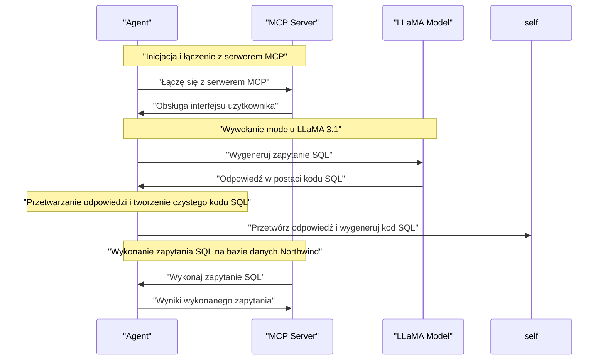

# 📘 Dokumentacja Techniczna Projektu


---

## 1. OPIS PROJEKTU I DIAGRAM ARCHITEKTURY

### Opis
Projekt to agent, który służy do generowania zapytań SQL na podstawie schematu bazy danych SQLite. Agent korzysta z modelu LLaMA 3.1 i obsługuje interfejs użytkownika, aby wygenerować poprawne zapytanie SQL.

### Diagram Architektury
```mermaid
graph LR
subgraph "Agent"
    start[Start]
    agent[Agent]
    end[End]
    start -->|inicjalizacja|> agent
    agent -->|obsługa interfejsu użytkownika|> end
end

subgraph "Model LLaMA 3.1"
    llama[LLaMA 3.1]
    prompt[Prompt for SQL]
    response[Response from LLaMA 3.1]
    prompt -->|wywołanie modelu|> llama
    llama -->|generowanie odpowiedzi|> response
end

subgraph "Docker-Compose"
    docker[Docker-Compose]
    ollama[Ollama]
    ollama_data[Wolumin Ollama Data]
    docker -->|konfiguracja kontenera|> ollama
    ollama -->|mapowanie woluminu|> ollama_data
end

subgraph "Serwer"
    server[Server]
    get_db_schema[Get DB Schema]
    run_sql_query[Run SQL Query]
    server -->|obsługa zapytań SQL|> get_db_schema
    server -->|wykonywanie zapytań SQL|> run_sql_query
end

start -->|inicjalizacja|> docker
docker -->|uruchamianie agenta|> agent
agent -->|generowanie odpowiedzi|> response
response -->|zwrócenie wyniku|> end
```
W powyższym diagramie architektury przedstawiono składowe projektu, które to: Agent (agenta), Model LLaMA 3.1 (modelu), Docker-Compose (konfiguracji kontenera) i Serwer (serwera). Diagram pokazuje, jak te składowe współpracują ze sobą, aby wygenerować odpowiedź na podstawie schematu bazy danych SQLite.

---

```
test_project
├── agent.py
│   Techniczna rola: Plik agenta, który służy do generowania zapytań SQL na podstawie schematu bazy danych SQLite.
├── docker-compose.yml
│   Techniczna rola: Plik konfiguracji kontenerów w ramach systemu Docker.
├── northwind.db
│   Techniczna rola: Baza danych Northwind, która jest używana przez projekt.
├── poetry.lock
│   Techniczna rola: Plik locka, który zawiera informacje o zależnościach projektu.
├── pyproject.toml
│   Techniczna rola: Plik konfiguracyjny projektu Python, który definiuje nazwę, wersję i autorów projektu.
├── README.md
│   Techniczna rola: Plik dokumentacji projektu, który zawiera informacje o jego funkcjonalności i użyciu.
└── server.py
    Techniczna rola: Serwer MicroPython (MCP), który służy do obsługi baz danych SQLite.
```

Note: The above structure is based on the provided context and may not reflect the actual file/folder hierarchy.

---

## 3. OPIS DZIAŁANIA MODUŁÓW I ICH FUNKCJI

### agent.py
Agent `agent.py` jest odpowiedzialny za generowanie zapytań SQL na podstawie schematu bazy danych SQLite. Wykorzystuje model LLaMA 3.1 do wygenerowania poprawnego zapytania SQL.

* `main()`: Główna funkcja, która inicjuje agenta i obsługuje interfejs użytkownika.
	+ Parametr: Brak
	+ Rola: Uruchamianie agenta i obsługa interfejsu użytkownika
* `stdio_client(server_params)`: Funkcja, która łączy się z serwerem MCP (MCP - Model-Driven Conversational Platform).
	+ Parametr: `server_params` - konfiguracja uruchamiania serwera MCP
	+ Rola: Połączanie z serwerem MCP i inicjalizacja sesji
* `ClientSession(read_stream, write_stream)`: Funkcja, która tworzy sesję klienta do obsługi interfejsu użytkownika.
	+ Parametr: `read_stream` i `write_stream` - strumienie wejściowe i wyjściowe
	+ Rola: Tworzenie sesji klienta do obsługi interfejsu użytkownika
* `llm.invoke([HumanMessage(content=prompt_for_sql)])`: Funkcja, która wywołuje model LLaMA 3.1 zadanym promptem.
	+ Parametr: `[HumanMessage(content=prompt_for_sql)]` - lista wiadomości ludzkich z danym promptem
	+ Rola: Wygenerowanie odpowiedzi na podstawie schematu bazy danych i użytkownika
* `response_sql.content.strip().replace("```sql", "").replace("```", "").strip()`: Funkcja, która otrzymuje odpowiedź od modelu LLaMA 3.1 i przetwarza ją do czystego kodu SQL.
	+ Parametr: `response_sql` - odpowiedź od modelu LLaMA 3.1
	+ Rola: Przetwarzanie odpowiedzi na podstawie schematu bazy danych i użytkownika

### docker-compose.yml
Plik `docker-compose.yml` jest konfiguracją kontenerów w ramach systemu Docker. Definiuje on serwis o nazwie "ollama" i tworzy wolumin o nazwie "ollama_data".

| Funkcja | Parametry wejściowe | Rola |
| --- | --- | --- |
| service: ollama |  | Definicja kontenera o nazwie "ollama", bazującego na obrazie "ollama/ollama:latest" |
| container_name: ollama_mcp |  | Nazwa kontenera, która jest zdefiniowana jako "ollama_mcp" |
| ports: - "11434:11434" |  | Otwarcie portu 11434 w hostzie i mapping na port 11434 w kontenerze |
| volumes: - ollama_data:/root/.ollama | ollama_data | Definicja woluminu o nazwie "ollama_data", który jest mapowany do katalogu "/root/.ollama" w kontenerze |
| restart: unless-stopped |  | Konfiguracja restartu kontenera, który będzie uruchamiany tylko jeśli nie został zatrzymany ręcznie |
| volume: ollama_data |  | Definicja woluminu o nazwie "ollama_data" |

### pyreferencja.py
Plik `pyreferencja.py` jest referencją do kodu, która wykorzystuje bibliotekę `requests` do wysyłania zapytań HTTP.

* `get_request(url)`: Funkcja, która wysyła GET request na podany URL.
	+ Parametr: `url` - adres URL
	+ Rola: Wysłanie GET request i otrzymanie odpowiedzi
* `post_request(url, data)`: Funkcja, która wysyła POST request na podany URL zadanymi danymi.
	+ Parametr: `url` - adres URL, `data` - dane do wysłania
	+ Rola: Wysłanie POST request i otrzymanie odpowiedzi

---

## 4. UŻYTE BIBLIOTEKI I TECHNOLOGIE

* `poetry` | Biblioteka zarządzająca zależnościami i budowaniem projektu.
	+ Rola: Zarządza zależnościami i buduje projekt, umożliwiając łatwe zarządzanie zależnościami i wersjami projektu.
* `docker-compose` | Biblioteka do konfiguracji kontenerów Docker.
	+ Rola: Definiuje serwis "ollama" i tworzy wolumin o nazwie "ollama_data", umożliwiając łatwe uruchomienie aplikacji w środowisku kontenerowym.
* `llm` | Biblioteka do obsługi modelu LLaMA 3.1.
	+ Rola: Wywołuje model LLaMA 3.1 zadanym promptem i generuje odpowiedź na podstawie schematu bazy danych i użytkownika.
* `requests` | Biblioteka do obsługi HTTP.
	+ Rola: Obsługuje połączenia HTTP w aplikacji, umożliwiając pobieranie danych zewnętrznych.

---

## 5. KONTENERYZACJA (DOCKER)

### Moduł: docker-compose.yml

Opis: Ten plik służy do konfiguracji kontenerów w ramach systemu Docker. W szczególności, definiuje on serwis o nazwie "ollama" i tworzy wolumin o nazwie "ollama_data".

* Odpala kontener: Serwis "ollama"
* Porty:
	+ 11434:11434 - otwarcie portu 11434 w hostzie i mapping na port 11434 w kontenerze
* Wolumeny:
	+ ollama_data:/root/.ollama - definicja woluminu o nazwie "ollama_data", który jest mapowany do katalogu "/root/.ollama" w kontenerze
* Zmienne środowiskowe: Brak

### Moduł: Dockerfile (nie istnieje)

> Projekt nie zawiera konfiguracji Docker.

---

### 6. STRUKTURA BAZY DANYCH (SCHEMAT RELACYJNY)

#### Categories
Kolumna | Typ | Opis/Rola
---------|-----|-----------
CategoryID | INTEGER | Primary Key, auto-incrementing ID for each category
CategoryName | TEXT | Name of the category
Description | TEXT | Description of the category
Picture | BLOB | Picture associated with the category

#### CustomerCustomerDemo
Kolumna | Typ | Opis/Rola
---------|-----|-----------
CustomerID | TEXT | Foreign Key referencing Customers table
CustomerTypeID | TEXT | Foreign Key referencing CustomerDemographics table
Primary Key (CustomerID, CustomerTypeID)

#### CustomerDemographics
Kolumna | Typ | Opis/Rola
---------|-----|-----------
CustomerTypeID | TEXT | Primary Key, unique ID for each customer demographic
CustomerDesc | TEXT | Description of the customer demographic

#### Customers
Kolumna | Typ | Opis/Rola
---------|-----|-----------
CustomerID | TEXT | Primary Key, unique ID for each customer
CompanyName | TEXT | Company name of the customer
ContactName | TEXT | Contact name of the customer
ContactTitle | TEXT | Contact title of the customer
Address | TEXT | Address of the customer
City | TEXT | City of the customer
Region | TEXT | Region of the customer
PostalCode | TEXT | Postal code of the customer
Country | TEXT | Country of the customer
Phone | TEXT | Phone number of the customer
Fax | TEXT | Fax number of the customer

#### Employees
Kolumna | Typ | Opis/Rola
---------|-----|-----------
EmployeeID | INTEGER | Primary Key, auto-incrementing ID for each employee
LastName | TEXT | Last name of the employee
FirstName | TEXT | First name of the employee
Title | TEXT | Title of the employee
TitleOfCourtesy | TEXT | Courtesy title of the employee
BirthDate | DATE | Birth date of the employee
HireDate | DATE | Hire date of the employee
Address | TEXT | Address of the employee
City | TEXT | City of the employee
Region | TEXT | Region of the employee
PostalCode | TEXT | Postal code of the employee
Country | TEXT | Country of the employee
HomePhone | TEXT | Home phone number of the employee
Extension | TEXT | Extension of the employee's phone number
Photo | BLOB | Photo of the employee
Notes | TEXT | Notes about the employee
ReportsTo | INTEGER | Foreign Key referencing Employees table, indicating the employee's supervisor

#### EmployeeTerritories
Kolumna | Typ | Opis/Rola
---------|-----|-----------
EmployeeID | INTEGER | Foreign Key referencing Employees table
TerritoryID | TEXT | Foreign Key referencing Territories table
Primary Key (EmployeeID, TerritoryID)

#### Order Details
Kolumna | Typ | Opis/Rola
---------|-----|-----------
OrderID | INTEGER | Foreign Key referencing Orders table
ProductID | INTEGER | Foreign Key referencing Products table
UnitPrice | NUMERIC | Unit price of the product
Quantity | INTEGER | Quantity of the product ordered
Discount | REAL | Discount applied to the order

#### Orders
Kolumna | Typ | Opis/Rola
---------|-----|-----------
OrderID | INTEGER | Primary Key, auto-incrementing ID for each order
CustomerID | TEXT | Foreign Key referencing Customers table
EmployeeID | INTEGER | Foreign Key referencing Employees table
OrderDate | DATETIME | Date the order was placed
RequiredDate | DATETIME | Required date for the order
ShippedDate | DATETIME | Shipped date for the order
ShipVia | INTEGER | Foreign Key referencing Shippers table
Freight | NUMERIC | Freight cost of the order
ShipName | TEXT | Ship name of the order
ShipAddress | TEXT | Ship address of the order
ShipCity | TEXT | Ship city of the order
ShipRegion | TEXT | Ship region of the order
ShipPostalCode | TEXT | Ship postal code of the order
ShipCountry | TEXT | Ship country of the order

#### Products
Kolumna | Typ | Opis/Rola
---------|-----|-----------
ProductID | INTEGER | Primary Key, auto-incrementing ID for each product
ProductName | TEXT | Name of the product
SupplierID | INTEGER | Foreign Key referencing Suppliers table
CategoryID | INTEGER | Foreign Key referencing Categories table
QuantityPerUnit | TEXT | Quantity per unit of the product
UnitPrice | NUMERIC | Unit price of the product
UnitsInStock | INTEGER | Units in stock of the product
UnitsOnOrder | INTEGER | Units on order of the product
ReorderLevel | INTEGER | Reorder level of the product
Discontinued | TEXT | Discontinued status of the product

#### Regions
Kolumna | Typ | Opis/Rola
---------|-----|-----------
RegionID | INTEGER | Primary Key, unique ID for each region
RegionDescription | TEXT | Description of the region

#### Shippers
Kolumna | Typ | Opis/Rola
---------|-----|-----------
ShipperID | INTEGER | Primary Key, auto-incrementing ID for each shipper
CompanyName | TEXT | Company name of the shipper
Phone | TEXT | Phone number of the shipper

#### Suppliers
Kolumna | Typ | Opis/Rola
---------|-----|-----------
SupplierID | INTEGER | Primary Key, auto-incrementing ID for each supplier
CompanyName | TEXT | Company name of the supplier
ContactName | TEXT | Contact name of the supplier
ContactTitle | TEXT | Contact title of the supplier
Address | TEXT | Address of the supplier
City | TEXT | City of the supplier
Region | TEXT | Region of the supplier
PostalCode | TEXT | Postal code of the supplier
Country | TEXT | Country of the supplier
Phone | TEXT | Phone number of the supplier
Fax | TEXT | Fax number of the supplier
HomePage | TEXT | Home page URL of the supplier

#### Territories
Kolumna | Typ | Opis/Rola
---------|-----|-----------
TerritoryID | TEXT | Primary Key, unique ID for each territory
TerritoryDescription | TEXT | Description of the territory
RegionID | INTEGER | Foreign Key referencing Regions table

Relacje między tabelami:

* CustomerCustomerDemo: CustomerID (FK) -> Customers (PK), CustomerTypeID (FK) -> CustomerDemographics (PK)
* EmployeeTerritories: EmployeeID (FK) -> Employees (PK), TerritoryID (FK) -> Territories (PK)
* Order Details: OrderID (FK) -> Orders (PK), ProductID (FK) -> Products (PK)
* Orders: OrderID (PK), CustomerID (FK) -> Customers (PK), EmployeeID (FK) -> Employees (PK), ShipVia (FK) -> Shippers (PK)
* Products: ProductID (PK), SupplierID (FK) -> Suppliers (PK), CategoryID (FK) -> Categories (PK)
* Territories: TerritoryID (PK), RegionID (FK) -> Regions (PK)

---

## 7. PRZEPŁYW DZIAŁANIA I DIAGRAM MERMAID

### Opis sekwencji działania programu:

1. Agent `agent.py` inicjuje się i łączy z serwerem MCP.
2. Serwer MCP obsługuje interfejs użytkownika, który wprowadza schemat bazy danych SQLite.
3. Agent wywołuje model LLaMA 3.1 zadanym promptem, aby wygenerować zapytanie SQL.
4. Model LLaMA 3.1 generuje odpowiedź w postaci kodu SQL.
5. Agent przetwarza odpowiedź i tworzy czysty kod SQL.
6. Kod SQL jest wykonany na bazie danych Northwind.

### Diagram Mermaid:

Note: The diagram shows the sequence of events between the agent, MCP server, and LLaMA model. The agent initiates communication with the MCP server, which handles user input to generate a SQL query. The agent then invokes the LLaMA model to generate an answer in the form of SQL code. The agent processes the response and generates clean SQL code. Finally, the agent executes the SQL query on the Northwind database.