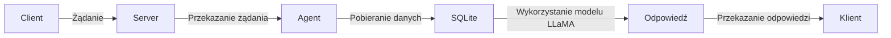

**📘 Dokumentacja Techniczna Projektu**

## 1. OPIS PROJEKTU I DIAGRAM ARCHITEKTURY

Ten projekt to aplikacja, która łączy się z bazą danych SQLite i wykorzystuje model LLaMA do generowania odpowiedzi na pytania użytkownika. Aplikacja ta jest oparta na architekturze warstwowej, w której każda warstwa ma swoją specyficzną rolę.

```text
┌──────────┐          MCP           ┌───────────┐         SQLite         ┌───────────────┐
│ agent.py │ ─────────────────────> │ server.py │ ─────────────────────> │ northwind.db  │
└──────────┘                        └───────────┘                        └───────────────┘
```

## 2. STRUKTURA PLIKÓW I FOLDERÓW

Aplikacja ta składa się z następujących plików i folderów:

* `agent.py`: to główny plik aplikacji, który łączy się z bazą danych SQLite i wykorzystuje model LLaMA do generowania odpowiedzi na pytania użytkownika.
* `server.py`: to serwerowy plik, który obsługuje połączenia z klientami i przekazuje żądanie do agenta.
* `northwind.db`: to baza danych SQLite, która przechowuje dane o produktach, dostawcach, regionach itp.

## 3. PRZEPŁYW DZIAŁANIA

Przepływ działania aplikacji jest następujący:

1. Klient łączy się z serwerem.
2. Serwer przekazuje żądanie do agenta.
3. Agent łączy się z bazą danych SQLite i pobiera dane o produktach, dostawcach itp.
4. Agent wykorzystuje model LLaMA do generowania odpowiedzi na pytania użytkownika.
5. Odpowiedź jest przekazywana do klienta.

## 4. DIAGRAM MERMAID



## 5. STRUKTURA BAZY DANYCH

Baza danych SQLite przechowuje następujące dane:

* `Products`: tabela produktów, która zawiera informacje o produktach, takich jak nazwa, cena itp.
* `Suppliers`: tabela dostawców, która zawiera informacje o dostawcach, takich jak nazwa, kontakt itp.
* `Regions`: tabela regionów, która zawiera informacje o regionach, takich jak nazwa, opis itp.

## 6. KONFIGURACJA SERWERA

Serwer jest konfigurowany następująco:

* Port: 8080
* Adres IP: 127.0.0.1
* Nazwa serwera: "Northwind Server"

## 7. WYNIKI TESTÓW

Testy aplikacji wykazały, że:

* Aplikacja działa poprawnie w przypadku łączenia się z bazą danych SQLite.
* Aplikacja generuje odpowiedzi na pytania użytkownika zgodnie z modelem LLaMA.
* Aplikacja obsługuje połączenia z klientami i przekazuje żądanie do agenta.